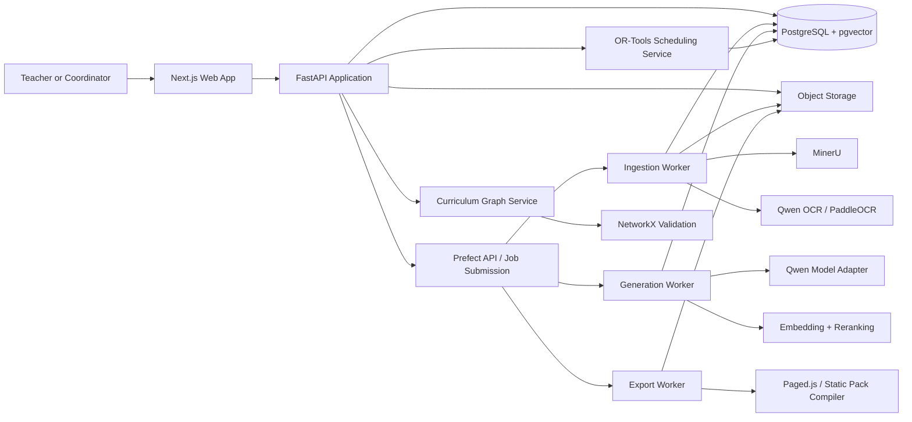
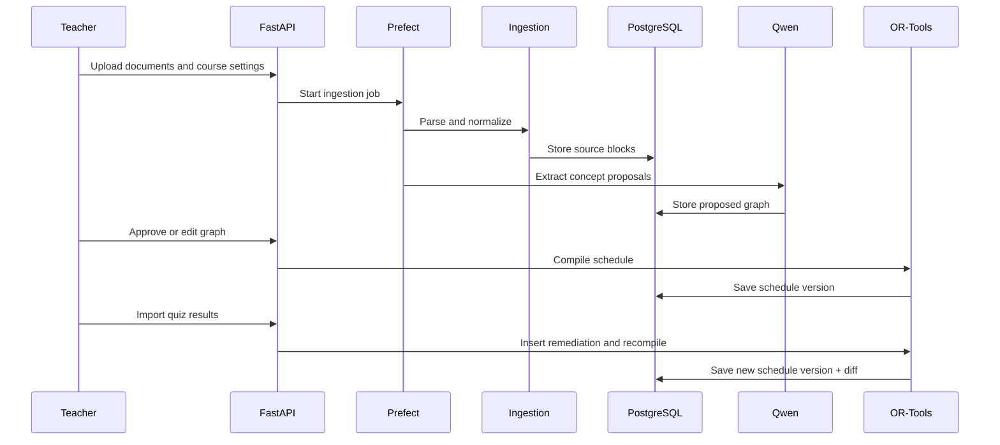

# System Architecture

## Architecture style

Use a modular monolith with background workers.

The web application, API, scheduling engine, graph logic, and AI adapters live in one repository with explicit package boundaries.

Do not split into microservices before load or team size justifies it.

## High-level components

## Separation of responsibilities

### Next.js

- forms;
- dashboards;
- graph review;
- schedule editing;
- progress input;
- export initiation;
- offline cache.

### FastAPI

- authentication;
- authorization;
- CRUD;
- job submission;
- curriculum state transitions;
- orchestration between deterministic services;
- signed download URLs.

### Prefect

- long-running ingestion;
- extraction;
- embedding;
- generation;
- export;
- retries;
- progress state.

### PostgreSQL

- all authoritative product state;
- relationships;
- versions;
- audit records;
- embeddings;
- job records.

### Object storage

- original uploads;
- normalized files;
- page images;
- generated assets;
- offline packs.

### Qwen

- semantic extraction;
- concept proposals;
- localization;
- lesson generation;
- question generation;
- rubric generation;
- explanation.

### OR-Tools

- timetable creation;
- timetable repair;
- constrained compression;
- remediation placement;
- buffer preservation.

### NetworkX

- cycle detection;
- topological order;
- dependency validation;
- impact traversal;
- graph metrics.

## Core event flow

## State rule

All important state must be reconstructable from PostgreSQL and object storage.

Do not depend on:

- in-memory agent state;
- chat history;
- browser-only data;
- Prefect internal state as the source of truth.
