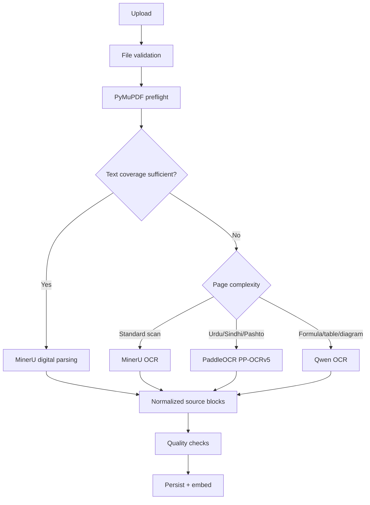

# Document Ingestion

## Goal

Convert heterogeneous school documents into stable, page-grounded source blocks.

## Supported MVP inputs

- born-digital PDF;
- scanned PDF;
- textbook;
- past exam paper;
- academic calendar;
- supplementary reader.

## Routing pipeline

## File validation

Check:

- MIME type;
- extension consistency;
- size limit;
- encrypted PDF;
- page count;
- malware scanning if available;
- duplicate content hash.

## Preflight metrics

For each page:

- extracted text length;
- image ratio;
- font count;
- rotation;
- OCR likelihood;
- table likelihood;
- formula likelihood;
- language hints.

## Source block types

- heading;
- paragraph;
- list;
- table;
- formula;
- figure;
- caption;
- exercise;
- question;
- answer;
- metadata.

## Normalization rules

- preserve original raw text;
- normalize whitespace in a separate field;
- never lose page number;
- preserve reading order;
- preserve table structure when possible;
- retain image crop reference;
- calculate content hash;
- record parser and confidence.

## Quality checks

- blank-page rate;
- repeated-header contamination;
- duplicate block rate;
- broken character ratio;
- suspicious OCR confidence;
- missing page sequence;
- reading-order anomalies.

## Human review

Provide a page viewer with:

- original page;
- overlayed bounding boxes;
- extracted block text;
- editable normalized text;
- parser confidence.

For the hackathon, human review may be limited to flagged pages.

## Idempotency

A document is identified by:

- file SHA-256;
- parser name and version;
- parser configuration.

Reprocessing the same combination should reuse results.
